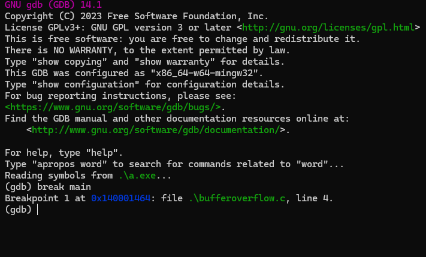
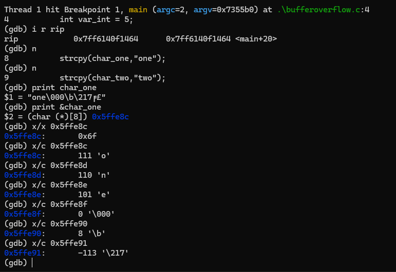
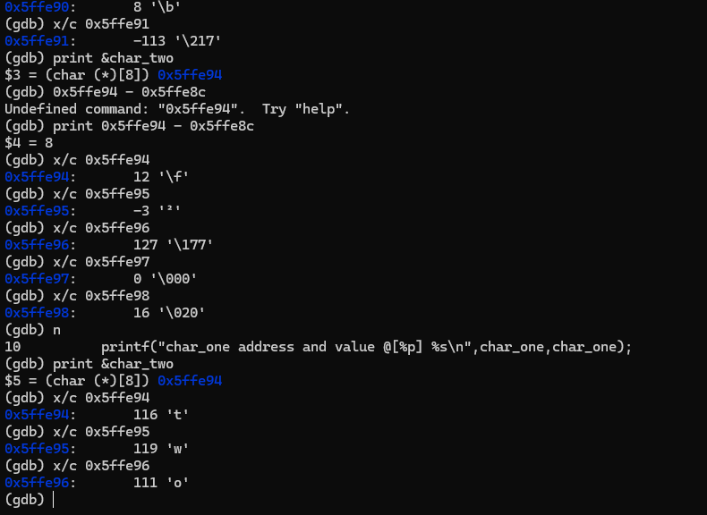
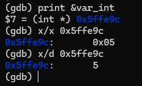
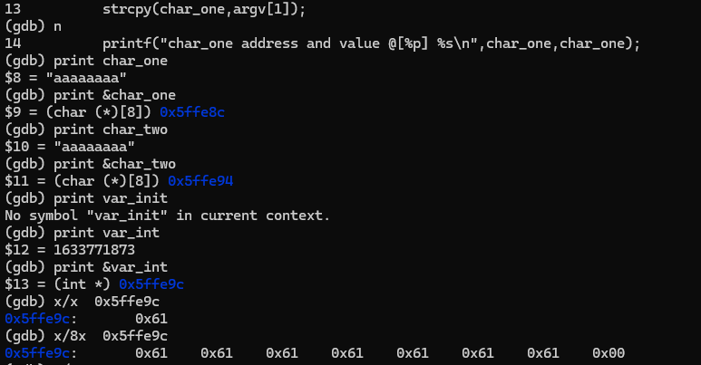

# BUFFER OVER FLOW 

In programming and information security, a buffer overflow or buffer overrun is an anomaly whereby a program writes data to a buffer beyond the buffer's allocated memory, overwriting adjacent memory locations.

## DEBUG 

`gcc -g buffoverflow.c`

`gdb -q ./a.out`

`break main`

`char_one`

`char_two`

`var_int`

`0X61 /97 /141	/61	/01100001	/a	/&#97;	 	/Lowercase a`
